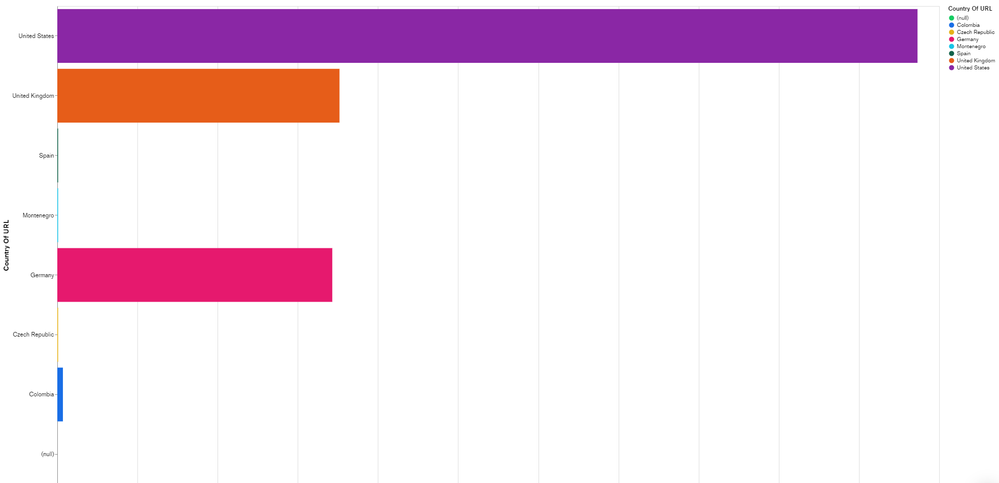
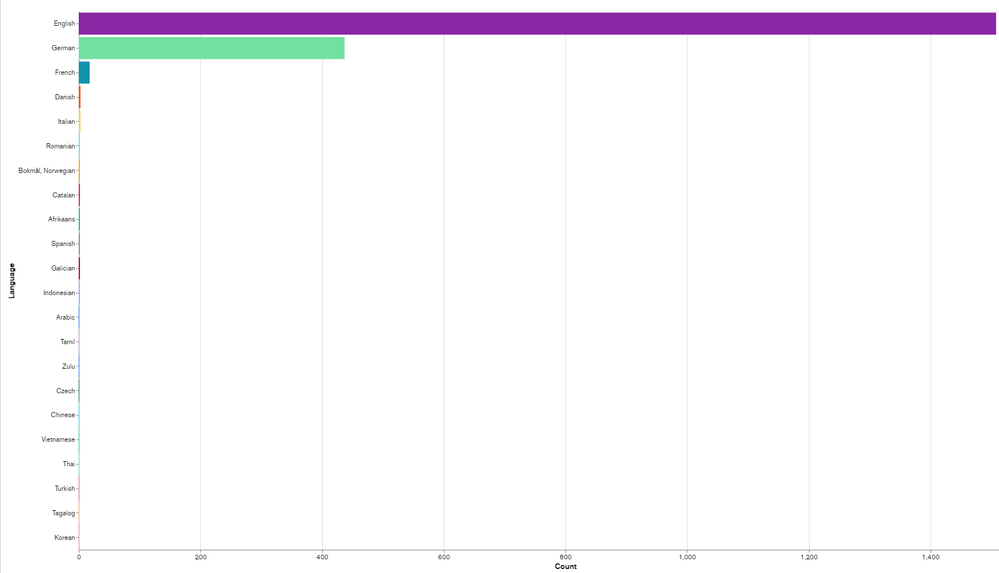
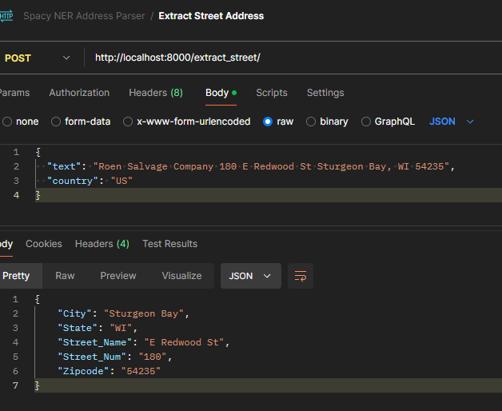
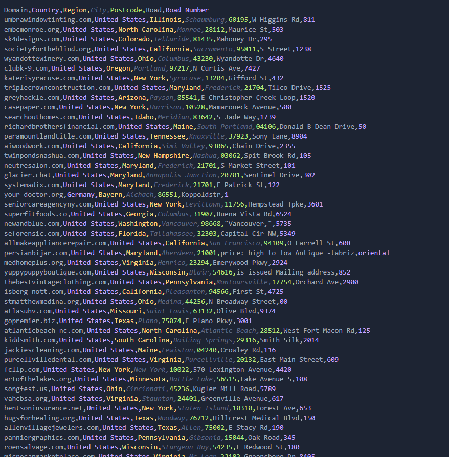

## Introduction
We have the following problem to tackle: get addresses off websites of companies from a given list of links, and organize the data in the following format: Domain,Country,Region,City,Postcode,Road,Road Number .
Why gather this information? Such data can be used for geospatial analysis, enabling mapping of regional market trends and demographic data. This data can also help in logistical planning and risk management.
## Technologies
Languages used: 
NodeJS (which will be the scraper) 
* Puppeteer (great headless browser which will help us scrape javascript loaded content too)
* Axios
* Cheerio
Python (with which we will create APIs to access trained ML Models)
* Spacy (for training NER models and, their pre-trained models will come in handy too)
* FastAPI

## Addresses types
Every country has it's own pattern or format for an address, so, let's see what we have to work with. Before we get into the initial scraping, let's see what extensions are in the list of our links, and what languages can be extracted from the pages. After making a quick script to add each domain to a CSV file and label the domain extension: .com, .co.uk etc., and also taking the text of the first page and use Node-NLP's language guesser to see what languages are on these pages, I have then added these to Mongo's Charts so we can visualize this.

Based on URL:


And based on Language:


I have compared both the domain and language because, just if a domain is .com, it can be anything, and if it's .de, it could easily be Austrian instead of German. This is something we will need to address later down the development of the scraper, but for now, we know that the main countries we need to take into account are US, UK and Germany. This way we can focus on the functionality of the scraper, then later on expand it's reach.

## Approach
The approach I've taken and present, is as follows:
* Access the page of the domain, and extract the page text itself and the full `<body>` with the html, so we can loop trough elements. The text will be used to extract geografical mentions and organization's names.
* Based on the extracted geografical entities extracted, we can decide the country of the business.
* We then search trough the page for the postcode with regex, once found, the rest of the address will be in the same text, which then we can parse.
## Getting the Data
First things first, we need to get the data. We can do that just with Axios but there will be cases where Axios will fail, especially in the case of JS loaded content. Puppeteer is a very popular tool used for scraping, a headless browser, an open-source project owned by Google. Using puppeteer will also open up the door to using other tools that can help our scraping script alot, such as Bright Data, in case we want to bypass Chaptas or we have issues with IP Bans. We will also use Cheerio to ease control over HTML elements.

Now, getting the html content will be easy, having our script loop trough the links from the .parquet file, and then take the data of each link and process it. But the issue is that sometimes, it will be a lot of irrelevant information. Such as `<script>` tags, the header or anything else. We will ignore these and take only the `<body>`.

### Finding and verifying the Address
Now that we have the HTML content, how do we go about finding the address? If we look at any example, it's a huge mess of HTML, to big to even show in this presentation, for it will take to much space. And the address could be located anywhere within the page, in the middle of it, top, bottom, or on another link of the page like in a `contacts` or `about` route.

We'll first do a bit of data pre-processing as mentioned before, taking only the `<body>`, and we will also make sure to remove irrelevant data, like images, scripts, and so on. Such data will cause big issues to our scrapper, resulting in inaccuarate and eronus extraction.

But what do we do with the remaining HTML? We can extract directly just the text from the page with puppeteer, and while that would work, we can do something different to actually help in our search, extraction and parsing. We will use the HTML elements to our advantage, this way we can take segments of text, which will be much easier to work with. 

While we are at this, we will also extract the links from `a` tags, to later search on other pages if needed. We can also prioritize the search trough key routes, as mentioned at earlier.

After looking trough a couple of pages to see the pattern, I've decided to have the scrapper loop trough elements with the following priority: `'p', 'address', 'font', 'span', 'strong', 'div'`.  This way, we can prioritize small segments of text in which addresses are located most of the times. The `div` tag will be a good backup in case the data is not structured the way we want it to.

Now how do we know when to stop when looping trough the page? Addresses come in many forms and can be irregular. Here are some examples of valid addresses: 

```
1)  102 main street
    Anytown, state

2)  400n 600e #2, 52173

3)  p.o. #104 60203
```

Even these are valid:

```
4)  829 LKSDFJlkjsdflkjsdljf Bkpw 12345

5)  205 1105 14 90210
```

But one thing seems to always be present, and that is the postcode, which has a unique format for every country. US postcodes are formed of 5 numbers, and always all the time, the state is mentioned, Germany also of 5, Romanian of 6 and UK of a set of characters and numbers. 

Regex will find the postcode perfectly and we can create a list of regexes for each country. 
### Extracting the country of the company
Before we go about searching for the postcode, we need to find out what is the country the business is from and then decide what address format are we looking for, specifically the postcode format which is easier to find.

Later down the presentation, in the "[What if there is no address on the page?](#what-if-there-is-no-address-on-the-page)" chapter, I have introduced SpaCy's NER models that can extract Geographical Entities and Organization names. We will use such a model to pass the text to and have the Geographical entities extracted. Based on that, we will introduce a scoring system.

Each mention of the country's name, region and city, will increase it's score. The country with the highest score will help us use the correct regex for the postcode format we need. Here is an example of a resulted score:

```
locations mentions:  [
  'Europe',
  'Canada',
  'Nordics',
  'Norway',
  'Erwitte',
  'Germany',
  'Düsseldorf',
  'Germany',
  'Friedrichshafen',
  'Germany'
]

received language:  en

{
  US: { score: 0, name: 'United States' },
  UK: { score: 0, name: 'United Kingdom' },
  AU: { score: 0, name: 'Australia' },
  NZ: { score: 0, name: 'New Zealand' },
  DE: { score: 10, name: 'Germany' },
  AT: { score: 0, name: 'Austria' },
  FR: { score: 0, name: 'France' },
  IT: { score: 0, name: 'Italy' },
  ES: { score: 0, name: 'Spain' },
  DN: { score: 0, name: 'Denmark' }
}

Country: Germany (score 10)
```

With a pre-generated list of regions and cities of the countries, we can easily count the score, and then use the correct regex to find the postcode and the rest of the address.

In case the score is not high enough, the scraper will continue to score countries until it gets a relevant score. We will also take the country that is in second place as a backup, in case the scoring was wrong
### Finding the postcode
Now knowing for what postcode format to find, all matches with the regex will be found in the page.

We also need to validate the postcode as well once found. There can be cases where we look for a US postcode, and a 5 digit number is located in the page, and it's not the postcode. This will end up in extracting the wrong text.

For the moment, a great solution is gathering all matching numbers, and pass them trough postcode APIs, which will also return the City and Region. This way we have already completed 3 of the columns of our resulted dataset. 

Every country has it's own database for their zipcodes and we can use their APIs for free. But for the moment, we will use ParseAPI, which is a postcode API for US, and ZipCodeBase which has a limited amount of uses, but it's international, so it will be a great tool during development.

Here is an example of how our data looks so far:
![[./screenshots/PostcodeResults.png]]

It's a great start! But the data is incomplete ofcourse, the street is missing, and there seem to be occasions when not even the postcode is extracted, But now we know where the address is located in the page, we can take the text where the postcode is located, and it will contain the rest of the address.

We will also have to clean our data up to make it easier for our code to extract the address.
### Cleaning the Data
Before we get the rest of the details from the address, we need to clean the text up. Many text samples we extract will come in with unencoded characters, break line characters like `\n` or `\t`, and potentially, even leftover HTML, and so on. This will hinder our process of accurately and correctly extracting addresses. 

We don't want to remove to much content either. A lot of symbols can provide context like comas, and many german street names, have '-' in them. So we will only focus for the text to look clean and human like.

With proper cleaning, we can ensure that the texts which we will evaluate, will look as the following:
```
div
1739 S Jade Way, Suite 100 Meridian, Idaho 83642 

p
Richard Brothers Financial Advisors 50 Donald B Dean Drive, Suite 1 South Portland, Maine 04106 

p
 8904 Sony Lane, Knoxville, TN 37923 

p
2355 Chain Drive, Ste: D Simi Valley, CA 93065 

div
105 Spit Brook Rd, Nashua, NH 03062, United States 

p
101 S Market Street Frederick, MD 21701 301-228-3670 

div
National Business Park 302 Sentinel Drive Annapolis Junction, MD 20701 

span
122 E Patrick St 120, Frederick, MD 21701, Statele Unite ale Americii 
```

We can also remove irrelevant information that can be spotted, such as phone numbers and emails, which might make the parsing of the addresses finicky. So in the case of this text: `101 S Market Street Frederick, MD 21701 301-228-3670`, we will have `101 S Market Street Frederick, MD 21701`. 
## NER Models
So, how do we go about labeling our addresses in the format we want? Because, at the end of the day, as much data cleaning we try to do, we will surely miss something. Addresses in companies websites will be irregular, many might have a pattern but it will not be always the same. And let's say we want to use regex, we can definitely look for words like Street, St, Drive, etc.  

But what about this street? `1739 S Jade Way`
We can put 'way' in our regex, but how do we know how many tokens we need to take to have the full street name? There are cases like this, numbers at the start and end of the street name `122 E Patrick St 120`.

List goes on, regex is not the solution for such a task. It works great for the postcode, yes, but that's because in that case, we look only for one singular token with a very specific pattern. 

This is where Named Entity Recognition (NER) models come into play. NER is a machine learning technique that classifies elements within a text into predefined categories such as names of people, organizations, locations, and more. For our purposes, NER can help classify and label different components of an address. They use statistical methods to understand and categorize text based on the context, which makes them highly adaptable and accurate.

One of the strengths of NER models is their ability to understand context. For instance, the word "Jordan" could refer to a person's name or a country. An NER model determines the correct classification based on the surrounding text. If the text says "I'm going to Jordan," the model uses context to infer that "Jordan" is likely a country.
 
After researching various NER models, I chose SpaCy for our address labeling task. SpaCy is a robust NLP library with pre-trained models for many tasks, including NER. SpaCy’s pre-trained pipelines are particularly adept at identifying companies and locations, providing a solid foundation for further training specific to our needs.
#### Training Strategy
How do we go about training the model? What is a good approach? 
This paper: [^3], present's a popular approach for our type of problem, BIO annotation (Beginning, Inside, Outside). So we will mark texts containing an address with the Outside text of the address, which is text non related to the address itself, Beginning text of the address, which will be the first token of the address, and the Inside text of the address. This is a great approach because as mentioned, no matter how much we clean our data, we can't address all edge cases, we need to teach our model how does an address look like, where does it start and where does it end. 

Here is a BIO annotation example (as presented in the paper): 
`Plant Location: 835 Township Line Rd Phoenixville, PA 19460-3097`
O - Plant; O - Location; O - : ; B - 835 (Beginning of street num); B - Township(Beginning of street name); I - Line (Inside street name); 
I - Rd (Inside street name) B - PhoenixVille (Beginning of city), O - , ; B - PA (Beginning of state); B - 19460(Beginning of postcode); I - '-' (Inside postcode); I - '3097'(Inside of postcode)

Now, Spacy doesn't have a BIO annotation available for their model, but something rather similar. Training data for Spacy is by defining the limits of each token, having it labeled appropriately. 

```
{
  "annotations": [
    {
      "text": "Registered Office: 35 Chequers Court Brown Street Salisbury Wiltshire SP1 2AS",
      "entities": [
        {
          "start": 18,
          "end": 21,
          "label": "Street_Number"
        },
        {
          "start": 22,
          "end": 47,
          "label": "Street_Name"
        },
        {
          "start": 18,
          "end": 47,
          "label": "Street_Address"
        },
        {
          "start": 48,
          "end": 57,
          "label": "City"
        },
        {
          "start": 58,
          "end": 67,
          "label": "State"
        },
        {
          "start": 68,
          "end": 75,
          "label": "Zip_Code"
        }
      ]
    }
  ]
}
```

We will structure and label training data inside a CSV file, which will then be processed by a python script and transformed into the corpus format Spacy understands.
#### Training Data
Now that we have a strategy, we only need the right data to train our Spacy NER address parser. Unfortunately, it's easier said then done.

This is an issue the authors of the earlier mentioned paper came across too. We need to train the model with the type of data we will send to him to evaluate, and that will tend to be organic data, and we will need a lot of examples. It will not be enough to train our model with a plain full address because the texts we will find wont always be like that.

The good thing is, we already have some data. We can use the scraper we've build so far, and take the texts extracted together with the postcode, which comes in various forms:
`WICKED ISLAND BAKERY 7 B BAYBERRY COURT NANTUCKET, MA 02554 WICKEDISLANDBAKERY@GMAIL COM`

`Plant Location: 835 Township Line Rd Phoenixville, PA 19460-3097`

`Mailing Address 160 Alamo Plaza Unit 1239 Alamo, CA 94507 Phone: 925-674-1000 Toll Free: 800-510-1095 Fax: 925-503-0472 Email: info@brmins com`

`Country Inn Suites, 236 Old Epps Bridge Road, Athens 30606 SCHEDULED TO SPEAK`

And with this, we can follow the approach of the paper, because we'll need more example texts. For now, we can take about 100 of the extracted texts we have, and make calls to the OpenAI api to have it generate more texts similar to them. We will also ask OpenAI to generate them in a CSV Format. The results still required some manual work, since the generation and labeling was not always correct. 

```
Text,Address,Street_Number,Street_Name,Street_Address,City,Zip_Code,State,Country
"7700 Las Vegas Blvd South Strip Las Vegas NV 89123 Contact us at Reservations: 702 736-4939 Take Out: 702 736-7080 Home Menu Our Story Entertainment Awards Parties Events Shop More... Use tab to navigate through the menu items.","7700 Las Vegas Blvd South Strip Las Vegas NV 89123",7700,Las Vegas Blvd South,7700 Las Vegas Blvd South,Las Vegas,89123,NV,
"OUR OFFICE 114 Joey Drive, Elk Grove Village, Il 60007","114 Joey Drive, Elk Grove Village, Il 60007",114,Joey Drive,114 Joey Drive,Elk Grove Village,60007,Il,
"EMAIL: sales@airservicesco.com Career Inquires: HR@airservicesco.com 211 Seegers Avenue Elk Grove Village, IL 60007 847 725-2100 COVID-19 STATEMENT","211 Seegers Avenue Elk Grove Village, IL 60007",211,Seegers Avenue,211 Seegers Avenue,Elk Grove Village,60007,IL,
"May 15 2024 Open House all day May 15 2024 Student Safety Committee Meeting 4 : 00 PM - 5 : 00 PM May 15 2024 LCAP PAC meeting 6 : 00 PM - 7 : 30 PM 351 S. Hudson Ave., Pasadena, CA 91101","351 S. Hudson Ave., Pasadena, CA 91101",351,S. Hudson Ave.,351 S. Hudson Ave.,Pasadena,91101,CA,
"Get In Touch! 573-883-7097 Welcome Center 66 South Main Street Ste. Genevive, MO 63670 info@visitstegen.com","66 South Main Street Ste. Genevive, MO 63670",66,South Main Street,66 South Main Street,Ste. Genevive,63670,MO,
```

The data looks good, it's organic and non repetitive. It contains both examples from the links we scraped and generated examples. Now with a good training data set in a CSV format, we only need to to write a `py` script to pre-process it and convert it into Spacy's docbin type for training the model.

#### Training the model
So now that we have the data, let's initiate training!

```
ℹ Saving to output directory: output\models                         4-289eead4f775
ℹ Using CPU

=========================== Initializing pipeline ===========================
✔ Initialized pipeline

============================= Training pipeline =============================
ℹ Pipeline: ['ner', 'entity_ruler']
ℹ Initial learn rate: 0.001
E    #       LOSS NER  ENTS_F  ENTS_P  ENTS_R  SCORE
---  ------  --------  ------  ------  ------  ------
  0       0     65.92   12.28    9.26   18.23    0.12
  0      10    832.94    8.61   52.94    4.69    0.09
  1      20    556.31   56.19   66.91   48.44    0.56
  1      30    322.49   74.57   83.77   67.19    0.75
  2      40    225.68   72.92   72.92   72.92    0.73
  3      50    155.22   83.65   86.19   81.25    0.84
  3      60    109.78   86.24   87.63   84.90    0.86
  4      70     96.27   86.91   87.37   86.46    0.87
  5      80     89.88   92.03   90.86   93.23    0.92
  5      90     49.84   91.24   90.31   92.19    0.91
  6     100     40.01   94.63   92.96   96.35    0.95
  7     110     28.16   93.19   93.68   92.71    0.93
  7     120     16.62   95.14   93.47   96.88    0.95
  8     130      6.21   93.81   92.86   94.79    0.94
  9     140      6.91   94.30   93.81   94.79    0.94
  9     150      7.04   93.85   92.42   95.31    0.94
 10     160     28.90   93.30   92.35   94.27    0.93
 11     170     13.93   93.30   92.35   94.27    0.93
 12     180     11.61   93.81   92.86   94.79    0.94
 12     190     11.70   94.85   93.88   95.83    0.95
 13     200      6.62   94.87   93.43   96.35    0.95
 14     210      8.99   94.60   93.40   95.83    0.95
 15     220     11.48   92.99   92.75   93.23    0.93
 15     230      7.40   94.87   93.43   96.35    0.95
 16     240      6.17   94.63   92.96   96.35    0.95
 17     250      0.93   95.38   93.94   96.88    0.95
 18     260      2.49   94.87   93.43   96.35    0.95
 18     270      3.61   94.09   92.89   95.31    0.94
 19     280      2.01   94.60   93.40   95.83    0.95
 20     290      0.05   94.87   93.43   96.35    0.95
 21     300      0.00   94.87   93.43   96.35    0.95
```

Score looks great and the Loss score went to 0. Now this doesn't mean our model is perfect, but we are on the right path. We can continue to train or model along development, once we gather more data and we come across more edge cases.

Let's give it a text and see the result:
```
"text": "Copyright document.writenew Date.getFullYear; 2024 Systemadix All Rights Reserved. info@systemadix.com 240.479.7700 122 East Patrick Street, Suite 120, Frederick, MD 21701"
"result":{
    "City": "Frederick",
    "State": "MD",
    "Street_Name": "East Patrick Street",
    "Street_Num": "122",
    "Zipcode": "21701"
}
`````

Result looks great! This is also an example from the extracted texts from our addresses. I have tested it against multiple cases with a reasonable amount of tokens and the extraction is good, but it will still fail sometimes:
```
"text": "Contractor Address City Phone Denali Sewer 2900 Boniface 537 Anchorage 907 333 5794 Alaska Drainfield Restorations 17228 Juanita Loop N Eagle River 907 696 0899"
"results": {
    "City": "Phone Denali Sewer",
    "State": null,
    "Street_Name": "Eagle River",
    "Street_Num": "0899",
    "Zipcode": "696"
}
```
In this case, the phone number causes an eronus extraction, but if we remove such details: `"Contractor Address City Phone Denali Sewer 2900 Boniface 537 Anchorage Alaska Drainfield Restorations 17228 Juanita Loop N Eagle River",`

The result ends up a little better:
```
{
    "City": "Phone Denali Sewer",
    "State": null,
    "Street_Name": "Eagle River",
    "Street_Num": "2900",
    "Zipcode": "17228"
}
```
At least now we have the Street and Zipcode correct, but with a bit more text pre-processing and more training data, our model will become more accurate. 

NOTE: Due to the approach we've taken, we will need to train and individual model for each country. We have the strategy so it will only be repetitive work.
## Putting the scraper and NER model together
We have to address one little inconvenience, and that is that our scraper is build in NodeJS and the NER model is in Python. But we can easily create a local Python API. So we will send the text we want parsed trough the API and get it back to post it into our results CSV file. We will declare a body to be sent trough the API, because we will also want a field for the country to select the proper model. The python script can also be made to recognize the language and select based on that, but it wont be the main approach, since it can cause issues.

Here is a look at our API in postman:


Looks great, it's all coming together now. Let's implement it in our scraper and look at the results:


Results are promising, apart from some wrong extractions, and some symbols that we should clean up. From now on, all we have to do is address these edge cases and train the models for other countries

But before that, there is one more main thing we need to take care of, and that is, not all companies have their address on their page.

### What if there is no address on the page?
There is plenty of cases where it acts as no more then just a landing page, talking about the company and what it does, or cases where the address is very inconsistent, or only half of it is in the page.

We will have 2 approaches, and when one fails, we will attempt another search with the other.

First approach is the easiest one. We can simply just take the name of the domain, without the extension, and use it as a google search query. Google will prioritize the perfect matching of the domain, and if the company has posted it's location on Google Maps, we will receive a Google Maps container, which will have the full address and have it parsed.

Most of the times, this approach will be successful, but we can add a backup too.

For the second approach, we will use SpaCy's pre-trained NER models, which are trained for many languages, and we can use the appropriate one to extract Company names and Locations. Here is an example from their documentation: 


Let's take one of their model's, put it on another local API, and pass in a text from a page from our list and see what we get.
Here is the result from the text of Umbra Window Tinting:
```
"GPE": [
        "Glendale Heights",
        "Schaumburg",
        "Glendale Heights",
        "Schaumburg",
        "Glendale Heights",
        "Schaumburg",
        "Schaumburg",
        "Glendale Heights",
        "Chicago",
        "Chicago",
        "Chicago",
        "SCHAUMBURG",
        "Schaumburg",
        "IL",
        "United States",
        "Glendale Heights",
        "IL",
        "United States"
    ]
    
"ORG": [
        "Umbra",
        "Umbra Window Tinting",
        "Tesla",
        "Umbra Window Tinting",
        "Umbra Window Tinting",
        "NORTHERN  ",
        "Umbra Window Tinting",
        "Tesla",
        "Tesla",
        "Detailers Roadmap",
        "8bitcreative, LLC"
    ],
```

And now, let's take each ORG and sort it along with the GPE that was found next to it, and sort them based on the similarity to the URL(which in most cases, if not all, it's the name of the company or institution).

```
"ORG_GPE_Sorted": [
        "Umbra Glendale Heights",
        "Umbra Window Tinting Schaumburg",
        "Umbra Window Tinting Glendale Heights",
        "NORTHERN   Schaumburg",
        "Tesla Glendale Heights",
        "Tesla Chicago",
        "Detailers Roadmap Chicago",
        "8bitcreative, LLC Chicago"
    ],
```

And now we can iterate trough the array, and use the item as a search query for google search, which will also display the Google Maps results with the address: `Adresă: 811 W Higgins Rd # B, Schaumburg, IL 60195, Statele Unite ale Americii`

If we still don't receive a Google Maps container, we can search trough the most relevant links after the google search, but if we don't get the maps result, then it most probably means the company simply doesn't have it's address public and we cannot access it.
## Edge Cases
Currently, there are a couple of edge cases our scraper faces.
One of the bigger issues is the country probability score which can be improved. With this method, we can't know for sure whether the mentioned regions, cities or country names are relevant. Sometimes, these mentions can be of business partners of a foreign country, and a wrong decision can be made. Or another example is of a turism company website, where it mentions countries and regions where the business runs, such case returning a confusing score.

Another one is puppeteer's functionality. While it's a great choice because it can handle JS loaded content, it has failed in cases where the domain would have outdated SSL protocols. Some of these links became accessible once configuring puppeteer to ignore SSL verification, but it doesn't work all the time. A viable solution seemed to be an Axios fallback, being able to extract the data because Axios is not a headless browser scraper, but a direct fetcher.
## Conclusion, overall results and accuracy
The scraper ended up being very robust. After testing and scraping, the majority of cases when the scraper fails to extract the address, is when the link is simply unaccessible or the address is not public.

The scraper has successfully extracted close to 70% of addresses.

All of the results can be found inside the results/finalResults folder.
## Problems and improvements
While our final scraper yielded great results, it is not without problems and there is room for improvement. 

First thing we notice is cost effectiveness. Our scraper currently depends on the Zipcodebase API which brings costs at higher numbers of requests. It worked as a great tool during development, and the simplest solution is to use a postcode API for each country, which are free, and return all the details we need

Results are not always perfect yet, they can be incomplete:
![Description 7][./screenshots/ErrounusExtractions.png]
But this is mostly due to incomplete training, or sometimes wrong extraction. For example, updating the postalcode regex for the US by searching for the state next to the code itself, fixed many issues, one being the extraction of road numbers that were big as the postcode, and more training of the models with more generalized examples has increased accuracy. The models themselfes are still not perfect, failing 5-10% of the time, but it can be improved over time.

We can also improve on the fact that we need to train individual models for each country. It's a great approach because it increases accuracy, but it can be difficult to maintain. In this paper [^5], the authors propose the addition of attention mechanisms that are used to focus on relevant address parts, and domain adversarial training ensures the model generalizes well across different countries. This method, leveraging zero-shot transfer learning, allows the model to effectively parse addresses from countries not seen during training without requiring extensive retraining.
## Performance 
When it comes to performance, the scraper can be slow. As long as many of the links we scrape, have their address on the first page, or can be found with a simple query search, the process wont take long, but this wont always be the case and deep searching might be required. Even the first two steps wont always be that fast, especially if we have thousands of links to process.

I've used multithreading to extract the results, breaking the list of links into `n` amount of chunks, for each thread, using worder.js for the scraper, and FastAPI for the python API as well, otherwise the API would get flodded and it wont be able to handle to many concurrent requests. So the more cores the machine the script running on has, the faster it can finish the process.
### Sources

[How to parse freeform street/postal address out of text, and into components](https://stackoverflow.com/questions/11160192/how-to-parse-freeform-street-postal-address-out-of-text-and-into-components) 
[Statistical NLP on OpenStreetMap Toward a machine-interpretable understanding of place](https://medium.com/@albarrentine/statistical-nlp-on-openstreetmap-b9d573e6cc86) 
[^3]: [Named Entity Recognition for Address Extraction in Speech-to-Text Transcriptions Using Synthetic Data](https://arxiv.org/pdf/2402.05545) (Slovak National Supercomputing Centre, Bratislava, Slovak Republic, Institute of Information Engineering, Automation, and Mathematics, Slovak University of Technology in Bratislava, Slovak Republic) 
[Machine learning innovations in address matching: A practical comparison of word2vec and CRFs](https://onlinelibrary.wiley.com/doi/full/10.1111/tgis.12522) 
[^5]: [Multinational Address Parsing: A Zero-Shot Evaluation](https://arxiv.org/pdf/2112.04008)